Project  5.1: Image Warping and Mosaicing
=========================================

Shoot the Pictures
------------------

Here are the digitized input images I used. The top row is the an outdoor view. It had a stright wire pole and building edges that can  be used to make sure the alignment is correct. The bottom row is an indoor view. It has a straight line at the top as well other sharp corners.

<table>
<col width="33%" />
<col width="33%" />
<col width="33%" />
<tbody>
<tr class="odd">
<td align="left">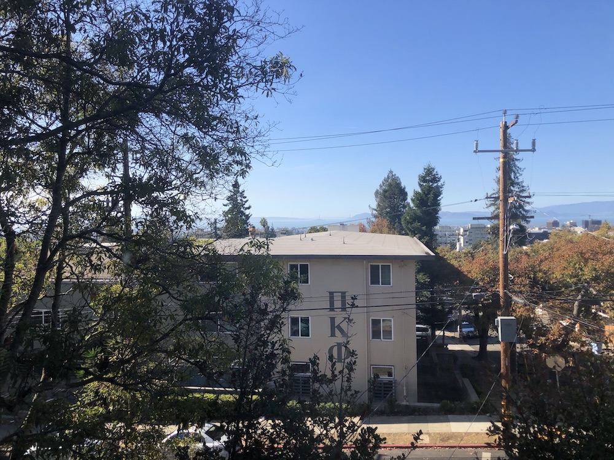Outside Image 1</td>
<td align="left">
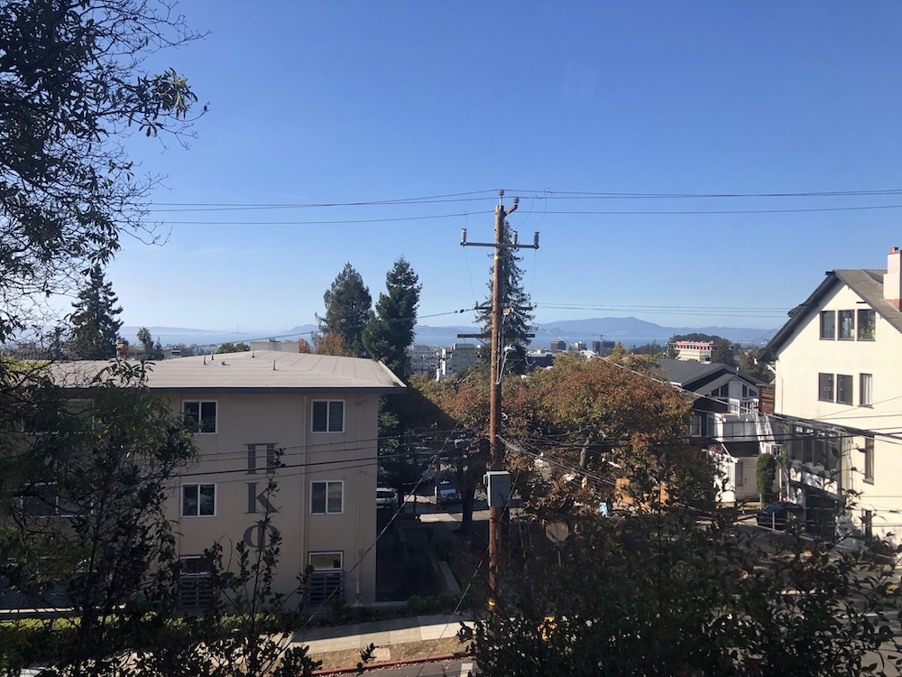

Outside Image 2
</td>
<td align="left">
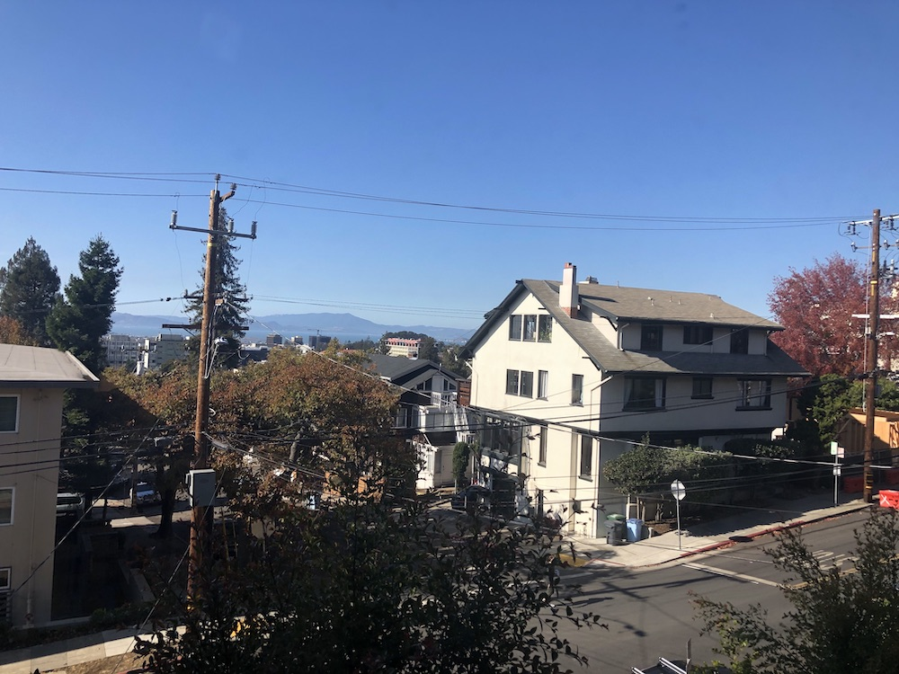

Outside Image 3
</td>
</tr>
<tr class="even">
<td align="left">
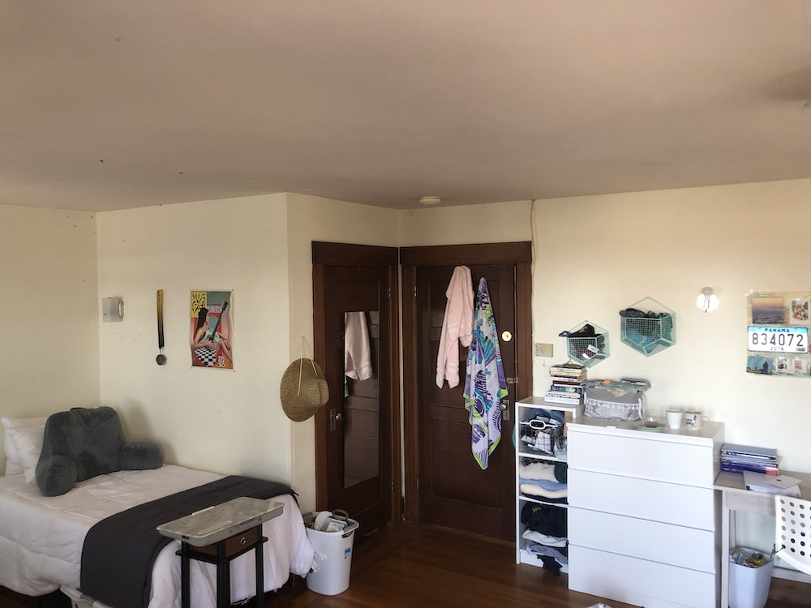

Inside Image 1
</td>
<td align="left">
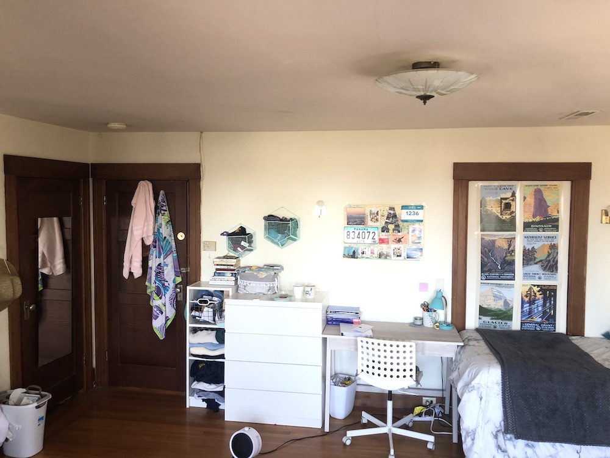

Inside Image 2
</td>
<td align="left">
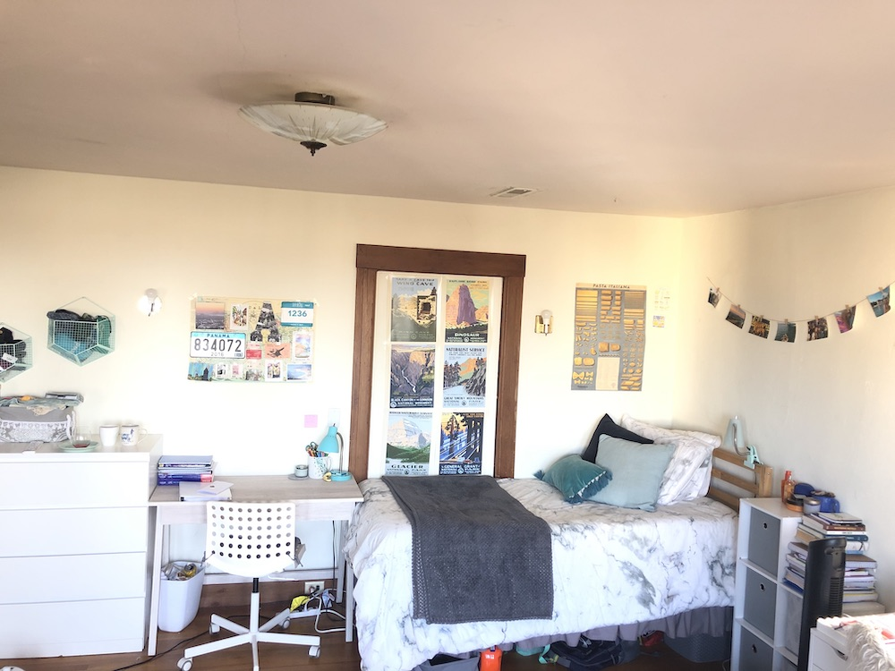

Inside Image 3
</td>
</tr>
</tbody>
</table>

Recover Homographies
--------------------

I utilized 10 corresponding points for each image when calculating the transformation between two images. Because I used 10 points, to avoid an overdetermined system I recovered the homography through a least-squares approach. This involved finding the homography matrix using a method that minimizes the sum of the squared differences between the observed corresponding points in the two images. The least-squares approach ensures a robust solution by minimizing errors and is particularly effective when dealing with situations where there are more equations than unknowns.

Warp The Image / Image Rectification
------------------------------------

Here are the results of my warping. The first image is warping from a trapezoid, or a square in different perspective, to a sqaure. The second is a slanted building into somewhat of a rectangular building.

<table>
<col width="50%" />
<col width="50%" />
<tbody>
<tr class="odd">
<td align="left">
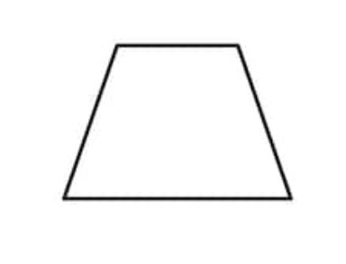

Trapezoid
</td>
<td align="left">
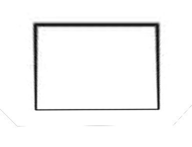

Warped Trapezoid into Sqaure
</td>
</tr>
<tr class="even">
<td align="left">
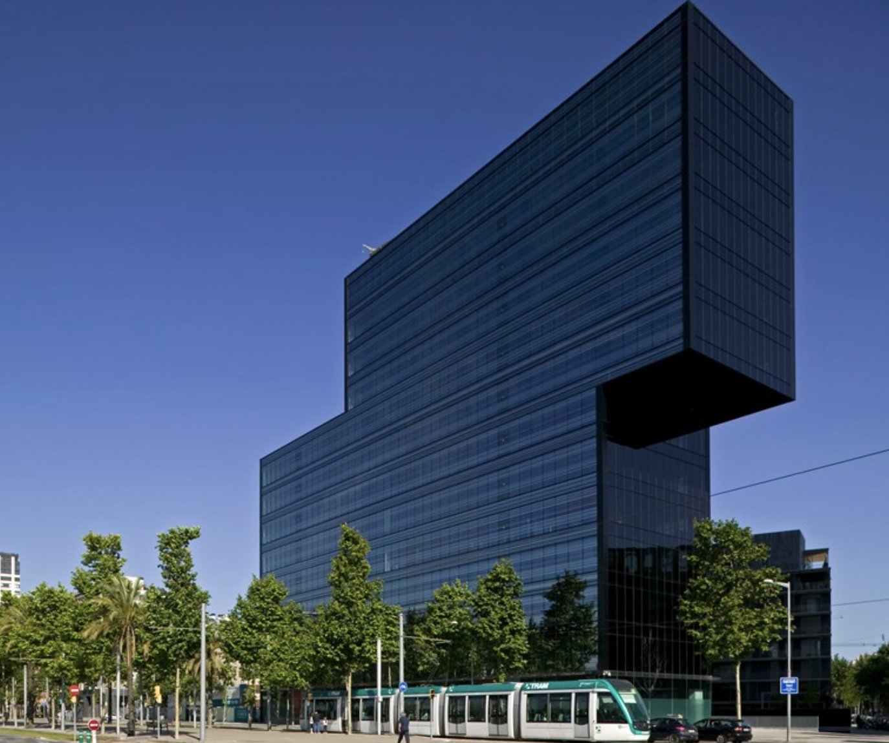

Slanted Building
</td>
<td align="left">
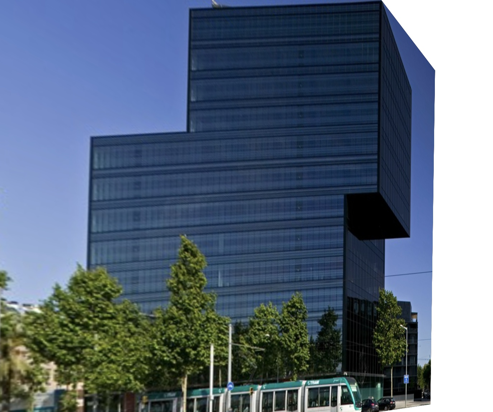

Warped Slanted Building into a Rectangle
</td>
</tr>
</tbody>
</table>

 

Blending Into Mosaic
--------------------

Below is the result of blending mulitple of my warped images together into one image. I used linear blending, a technique that calculates pixel values in the blended image as a weighted average of corresponding pixels in the input images, providing a smooth transition between the warped images. I also whited out the edges.

<table>
<col width="100%" />
<tbody>
<tr class="odd">
<td align="left">
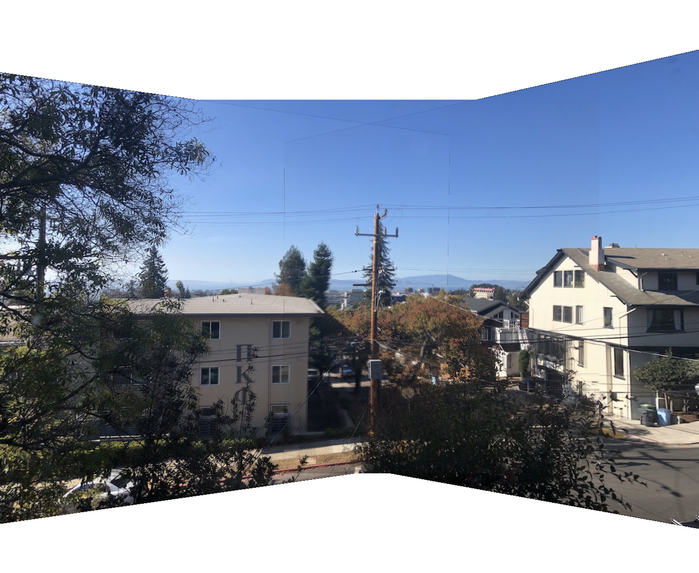

Blended Outside Image
</td>
</tr>
<tr class="even">
<td align="left">
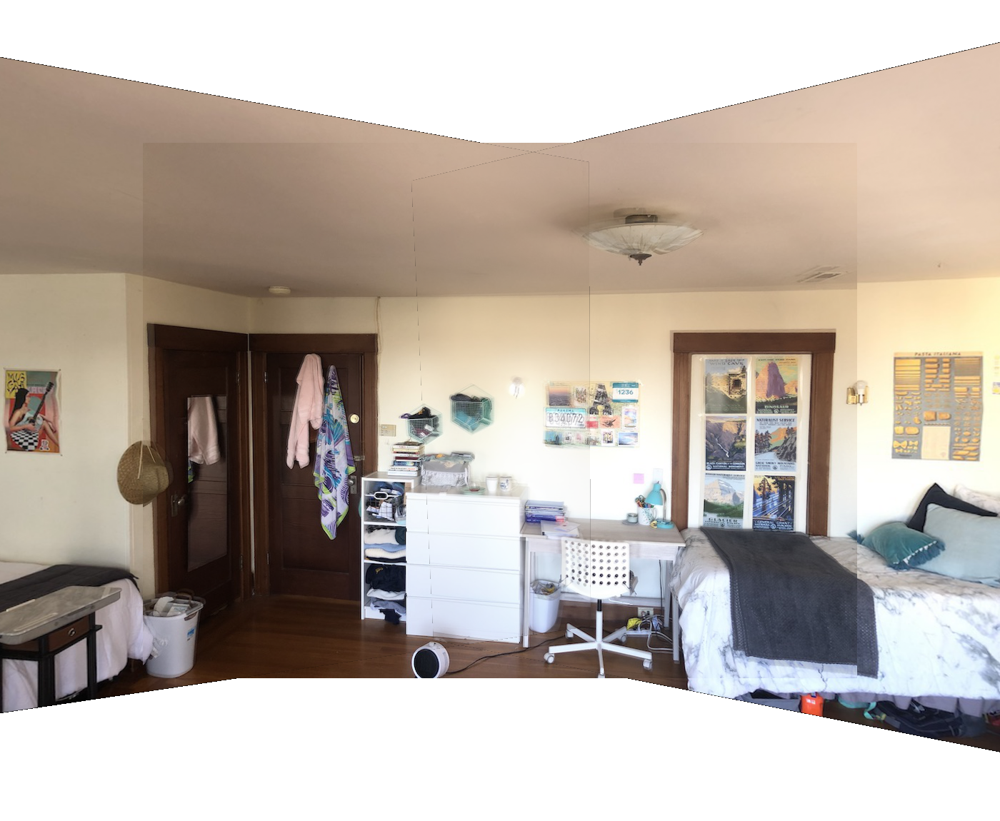

Blended Inside Image
</td>
</tr>
</tbody>
</table>

Project  5.2: Auto Stitching
============================

Harris Interest Points
----------------------

Below is the result of getting Harris interest points on my images. These are key points in an image that signify significant changes in intensity or texture. These points are identified using the Harris corner detection algorithm, which evaluates the variations in pixel intensities in different directions. The algorithm calculates a corner response function for each pixel, considering local intensity changes in multiple directions. Harris interest points are locations where the response function achieves high values, indicating the presence of corners or distinctive features. In the provided images, the Harris interest points are overlaid to highlight these significant features. The points are shown overlaid a sample images.

<table>
<col width="100%" />
<tbody>
<tr class="odd">
<td align="left">
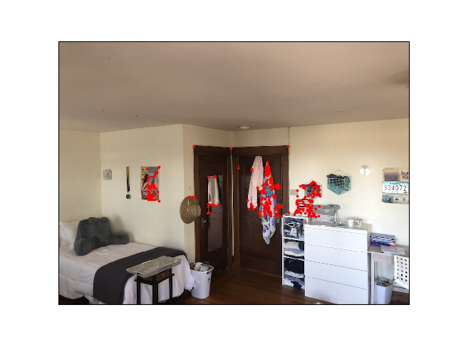

Harris Interest Points
</td>
</tr>
</tbody>
</table>

Adaptive Non-Maximal Suppression
--------------------------------

Adaptive Non-Maximal Suppression (ANMS) is a technique used to refine and optimize the selection of interest points detected by algorithms. The purpose of ANMS is to reduce redundancy and select the most salient points, ensuring a more informative and compact set of features.

In ANMS, each detected interest point is assigned a suppression radius based on its corner response value. The suppression radius indicates the minimum distance an interest point must have from others to avoid redundancy. Points with higher corner responses will have larger suppression radii, allowing them to retain their positions even if close to other points with lower responses.

By adaptively adjusting the suppression radii, ANMS ensures that the final set of interest points is well-distributed and captures the most distinctive features in the image, enhancing the effectiveness of feature-based algorithms for computer vision tasks.

Below is the result of applying Adaptive Non-Maximal Suppression to the Harris Points

<table>
<col width="100%" />
<tbody>
<tr class="odd">
<td align="left">
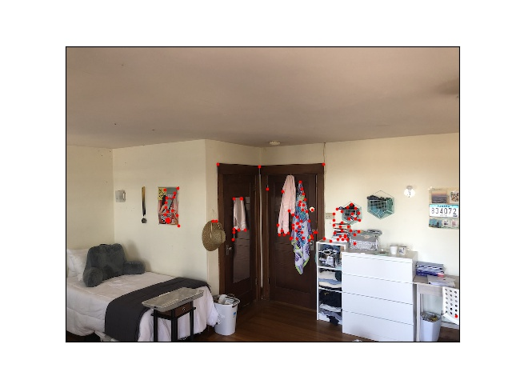

New Points
</td>
</tr>
</tbody>
</table>

Final Outcome
-------------

Below is the result after warping and blended the images (with same logic as above), using the auto generated points.

<table>
<col width="100%" />
<tbody>
<tr class="odd">
<td align="left">
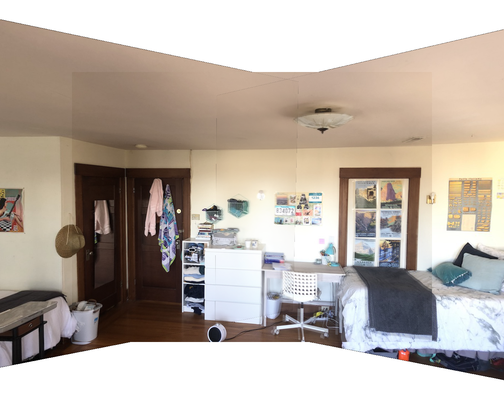

Final Mosaic Indoor
</td>
</tr>
</tbody>
</table>

<table>
<col width="100%" />
<tbody>
<tr class="odd">
<td align="left">
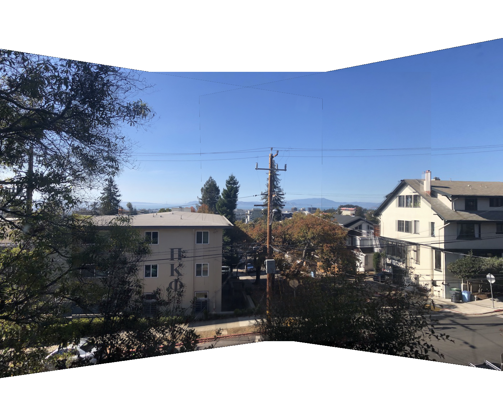

Final Mosaic Outdoor
</td>
</tr>
</tbody>
</table>

