Project 2: Fun with Frequencies 
================================

Part 1: Fun with Filters
------------------------

#### Part 1.1: Finite Difference Operator

I began by creating two finite difference operators, one in the x direction, Dx, and one in the y direction, Dy. Subsequently, I calculated the partial derivatives in both x and y directions utilizing scipy.signal.conv2d to convolve the image separately with Dx and Dy. To determine the gradient magnitude, I squared the partial derivatives, summed them, and then took the square root. To convert this into an edge image while mitigating noise, I applied binarization to the gradient magnitude using a threshold of 0.15. The outcomes of this process are presented below.

<table>
<col width="50%" />
<col width="50%" />
<tbody>
<tr class="odd">
<td align="left"><em>partial  derivative of x</em></td>
<td align="left"><em>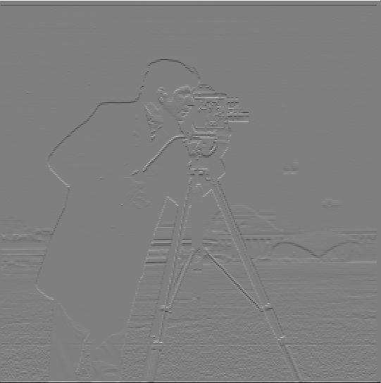partial  derivative of y</em></td>
</tr>
<tr class="even">
<td align="left">
<em>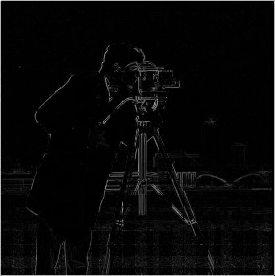</em><em>gradient magnitude</em>
</td>
<td align="left">
<em>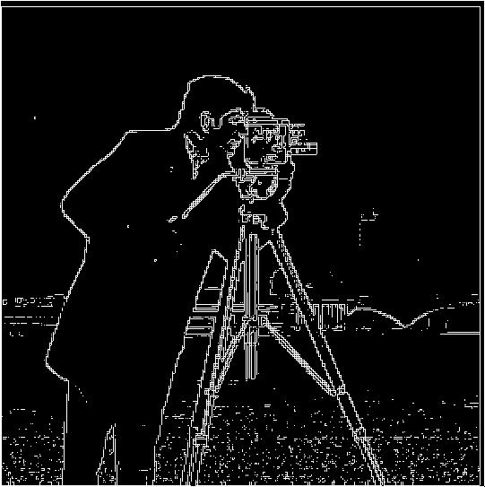binarized edge image</em>
</td>
</tr>
</tbody>
</table>

#### Part 1.2: Derivative of Gaussian (DoG) Filter

I initially generated a smoothed version of the original image by applying a 2-dimensional Gaussian filter using scipy.signal.convolve2d and cv2.getGaussianKernel() with parameters ksize = 3 and sigma = 1. Following that, I replicated the procedures outlined in section 1.1, involving convolutions with the blurred image using Dx and Dy filters, computing the gradient magnitude, and creating a binarized edge image with a threshold of 0.08. The obtained results include the gradient magnitude and the binarized edge image, as illustrated in the images below:

<table>
<col width="50%" />
<col width="50%" />
<tbody>
<tr class="odd">
<td align="left">
<em></em>

<em>gradient magnitude</em>
</td>
<td align="left">
<em>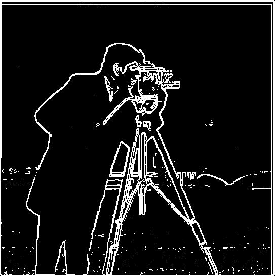</em>

<em>binarized edge image</em>
</td>
</tr>
</tbody>
</table>

In comparison to the outcomes of 1.1, this approach significantly reduces noise and enhances edge visibility. The improvement is attributed to the initial blurring of the image before convolution.

I streamlined these procedures into a single convolution by developing derivative of Gaussian (DoG) filters. The Gaussian filter was convolved with Dx and Dy, and the same threshold was applied. The resulting DoG filters are presented visually, along with the resultant gradient and edge images.

<table>
<col width="50%" />
<col width="50%" />
<tbody>
<tr class="odd">
<td align="left">
<em>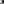</em>

<em>DoG for Dx</em>
</td>
<td align="left">
<em></em>

<em>DoG for Dy</em>
</td>
</tr>
</tbody>
</table>

 

<table>
<col width="50%" />
<col width="50%" />
<tbody>
<tr class="odd">
<td align="left">
<em>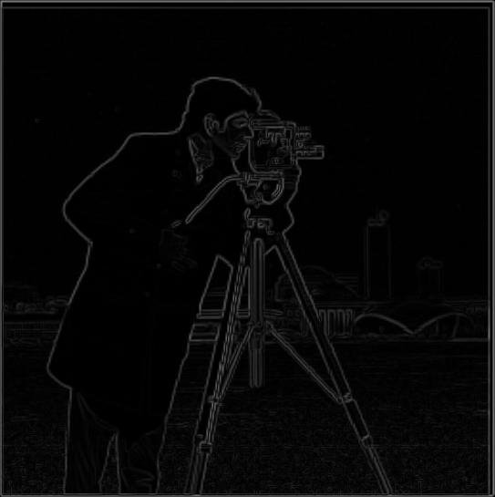</em>

<em>gradient magnitude</em>
</td>
<td align="left">
<em></em>

<em>binarized edge image</em>
</td>
</tr>
</tbody>
</table>

#### Part 1.3: Image Straightening 
In this section, I automated the process for aligning images. The procedure involved examining each image from various angles within the range of -20 to 20 degrees. For each angle, the image was rotated using scipy.ndimage.interpolation.rotate. Subsequently, the rotated image was cropped to focus on the center, enabling the computation of gradient angles.

The next steps included computing the partial derivatives of both x and y and utilizing them to determine the gradient angles of the image (arctan(-dy/dx)). The process involved summing up the number of horizontal and vertical edges in the image for each angle. By comparing the total sums of horizontal and vertical edges across angles, the angle that yielded the highest sum was identified as the optimal rotation angle for straightening the image.

Facade image: rotated -2.04 degrees

<table>
<col width="50%" />
<col width="50%" />
<tbody>
<tr class="odd">
<td align="left">
<em></em>

<em>original facade</em>
</td>
<td align="left">
<em></em>

<em>rotated facade</em>
</td>
</tr>
<tr class="even">
<td align="left">
<em>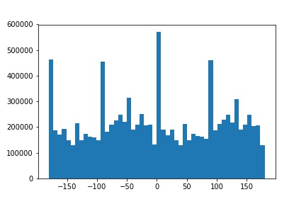</em>

<em>original orientation histogram</em>
</td>
<td align="left">
<em>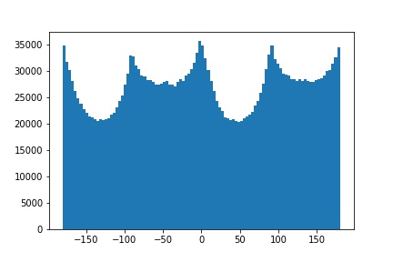</em>

<em>rotated orientation histogram</em>
</td>
</tr>
</tbody>
</table>

 Austin Skyline image: rotated -11.84 degrees

<table>
<col width="50%" />
<col width="50%" />
<tbody>
<tr class="odd">
<td align="left">
<em></em>

<em>original austin</em>
</td>
<td align="left">
<em>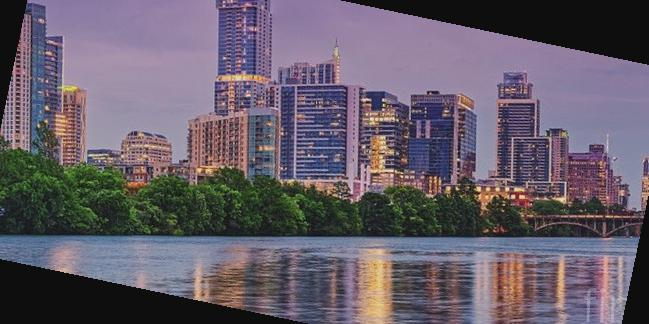</em>

<em>rotated austin</em>
</td>
</tr>
<tr class="even">
<td align="left">
<em>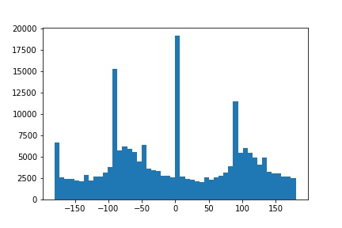</em>

<em>original orientation histogram</em>
</td>
<td align="left">
<em>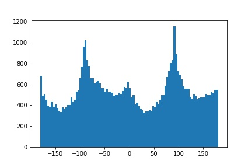</em>

<em>rotated orientation histogram</em>
</td>
</tr>
</tbody>
</table>

Leaning Tower of Pisa image: rotated 4.49 degrees

<table>
<col width="50%" />
<col width="50%" />
<tbody>
<tr class="odd">
<td align="left">
<em>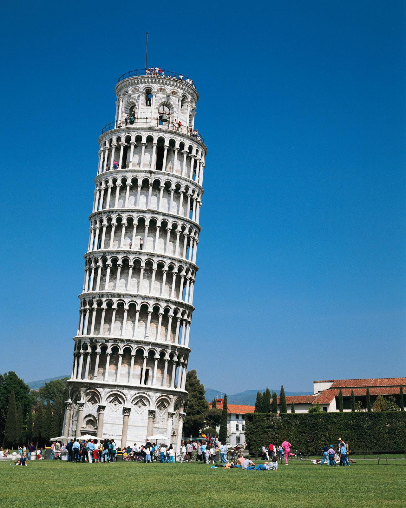</em>

<em>original pisa</em>
</td>
<td align="left">
<em>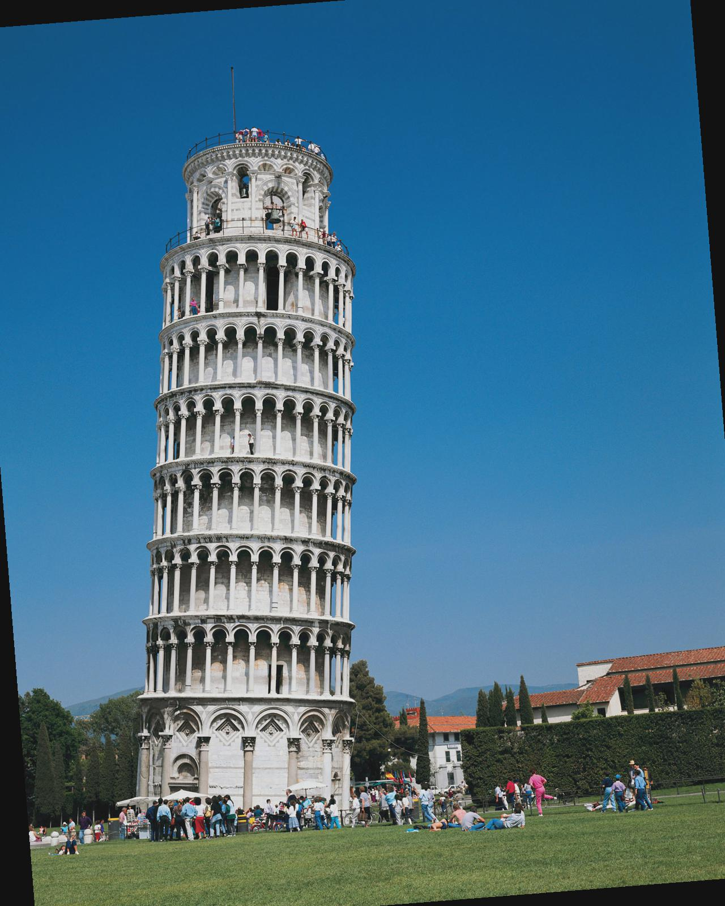</em>

<em>rotated pisa</em>
</td>
</tr>
<tr class="even">
<td align="left">
<em>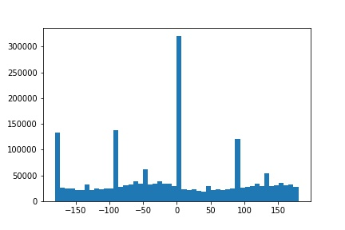</em>

<em>original orientation histogram</em>
</td>
<td align="left">
<em>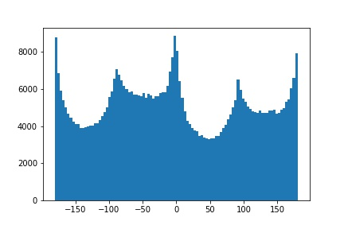</em>

<em>rotated orientation histogram</em>
</td>
</tr>
</tbody>
</table>

[FAILED] Round candy: rotated -15.9 degrees. The automated rotation failed in this case because it utilizes straight edges, whereas this image has minimal straight edges.

<table>
<col width="50%" />
<col width="50%" />
<tbody>
<tr class="odd">
<td align="left">
<em>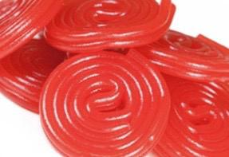</em>

<em>original round candy</em>
</td>
<td align="left">
<em>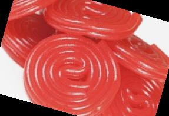</em>

<em>rotated round candy</em>
</td>
</tr>
<tr class="even">
<td align="left">
<em>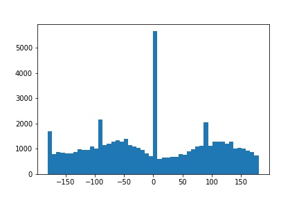</em>

<em>original orientation histogram</em>
</td>
<td align="left">
<em>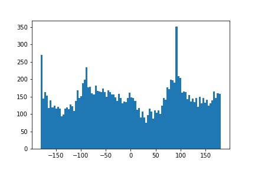</em>

<em>rotated orientation histogram</em>
</td>
</tr>
</tbody>
</table>

Part 2: Fun with Frequencies
----------------------------

#### Part 2.1: Image Sharpening

Here we derive the unsharp masking technique. The first step involved creating a low-pass filter, specifically a Gaussian filter, designed to retain the low frequencies of the image. To get the high freqencies of the image, I subtract the low-frequecies from the origial image. To "sharpen" the image, I simply add the high frequencies back into the original image. I combined this into one colvolution, creating the unsharp mask filter, which follows the following equation: sharp\_image = ((alpha + 1) \* original\_image) - (alpha \* low\_pass\_image). I attempted to get rid of the dimming effect by normalizing the output, clipping the output, and trying various different saving methods (plt vs skimg.io). Unfortunatetly, I was unable to fully get rid of the dimming effect. Below are my results.

<table>
<col width="50%" />
<col width="50%" />
<tbody>
<tr class="odd">
<td align="left">
<em></em>

<em>original image</em>
</td>
<td align="left">
<em>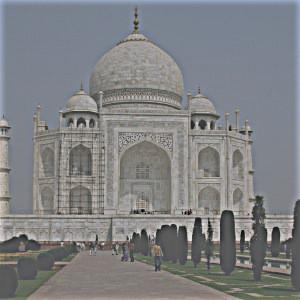</em>

<em>sharpening image</em>
</td>
</tr>
</tbody>
</table>

 

<table>
<col width="50%" />
<col width="50%" />
<tbody>
<tr class="odd">
<td align="left">
<em>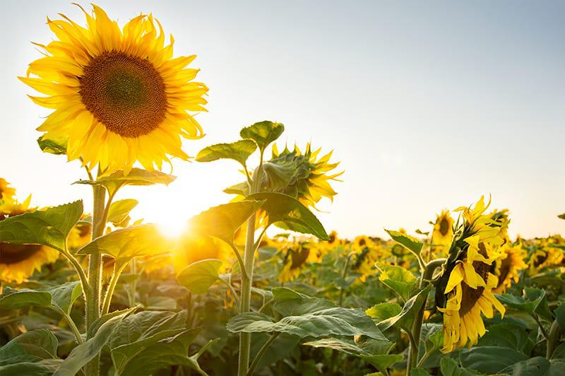</em>

<em>original image</em>
</td>
<td align="left">
<em>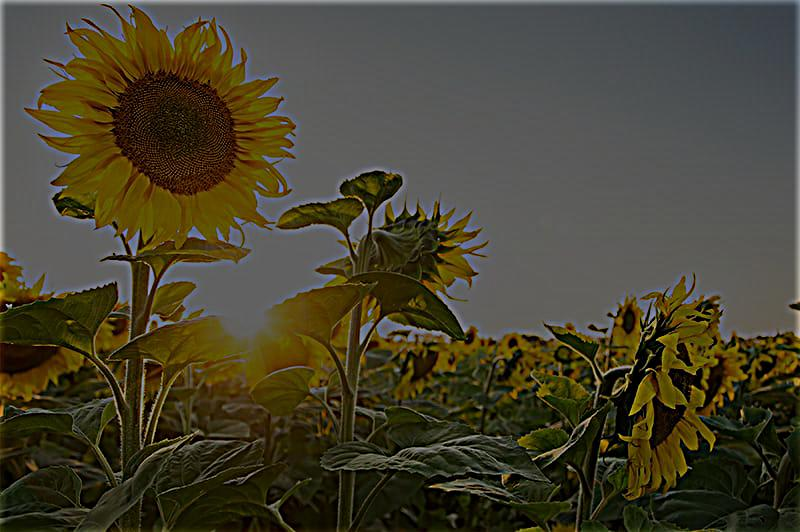</em>

<em>sharpening image</em>
</td>
</tr>
</tbody>
</table>

For evaluation. I picked a sharp image, blurred it using a gaussian filter, then passed this blurred image through the unsharp mask filter to obtaint the original image.

<table>
<col width="33%" />
<col width="33%" />
<col width="33%" />
<tbody>
<tr class="odd">
<td align="left">
<em></em>

<em>original sharp image</em>
</td>
<td align="left">
<em>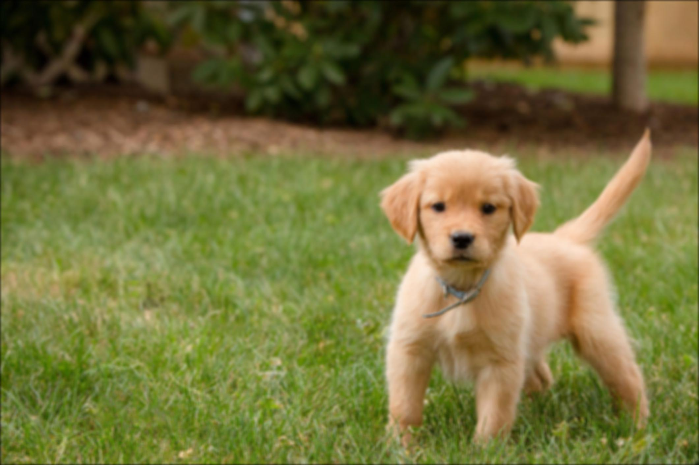</em>

<em>blurred image</em>
</td>
<td align="left">
<em></em>

<em>sharpened blurred image</em>
</td>
</tr>
</tbody>
</table>

#### Part 2.2: Hybrid Images

The basic idea of the hybrid image is that up close, the high frequencies dominate our perception, but far away, the low frequencies dominate. I took two images, one to dominate low frequencies, and one to dominate high frequencies. I used a guassian filter to create a low pass of image 1 and followed a similar technique as in 2.1 to obtain the high-frequencies of image 2. To compute the hybrid image, I simply take the average of the low-pass image summed with high-pass image. Below are my results.

Derek and his cat

<table>
<col width="33%" />
<col width="33%" />
<col width="33%" />
<tbody>
<tr class="odd">
<td align="left">
<em></em>

<em>image 1</em>
</td>
<td align="left">
<em></em>

<em>image 2</em>
</td>
<td align="left">
<em>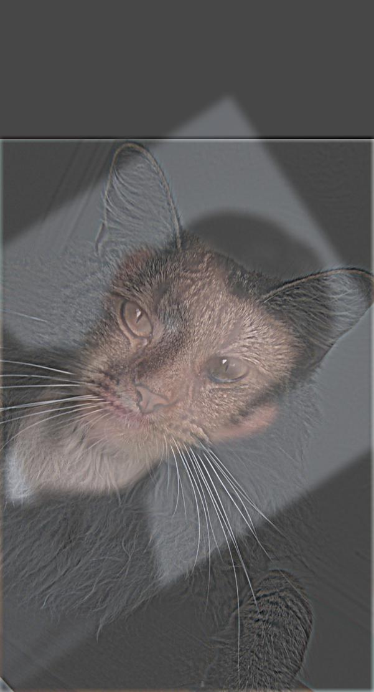</em>

<em>hybrid image</em>
</td>
</tr>
</tbody>
</table>

 

Ted cruz and blob fish... yes, the resemblance IS uncanny

<table>
<col width="33%" />
<col width="33%" />
<col width="33%" />
<tbody>
<tr class="odd">
<td align="left">
<em>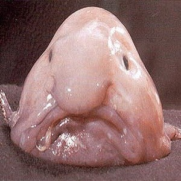</em>

<em>image 1</em>
</td>
<td align="left">
<em>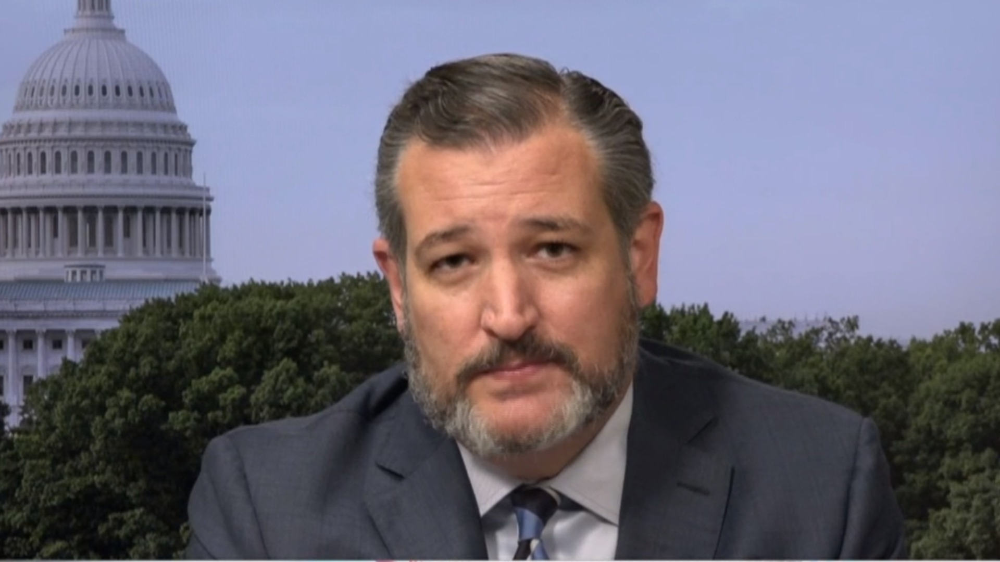</em>

<em>image 2</em>
</td>
<td align="left">
<em>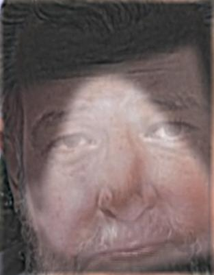</em>

<em>hybrid image</em>
</td>
</tr>
</tbody>
</table>

I also illustrate the process through frequency analysis by showing the log magnitude of the Fourier transform of the two input images, the filtered images, and the hybrid image. Below are my results

Labradoodle Puppy and corresponding fourier transforms

<table>
<col width="20%" />
<col width="20%" />
<col width="20%" />
<col width="20%" />
<col width="20%" />
<tbody>
<tr class="odd">
<td align="left">
<em></em>

<em>image 1</em>
</td>
<td align="left">
<em>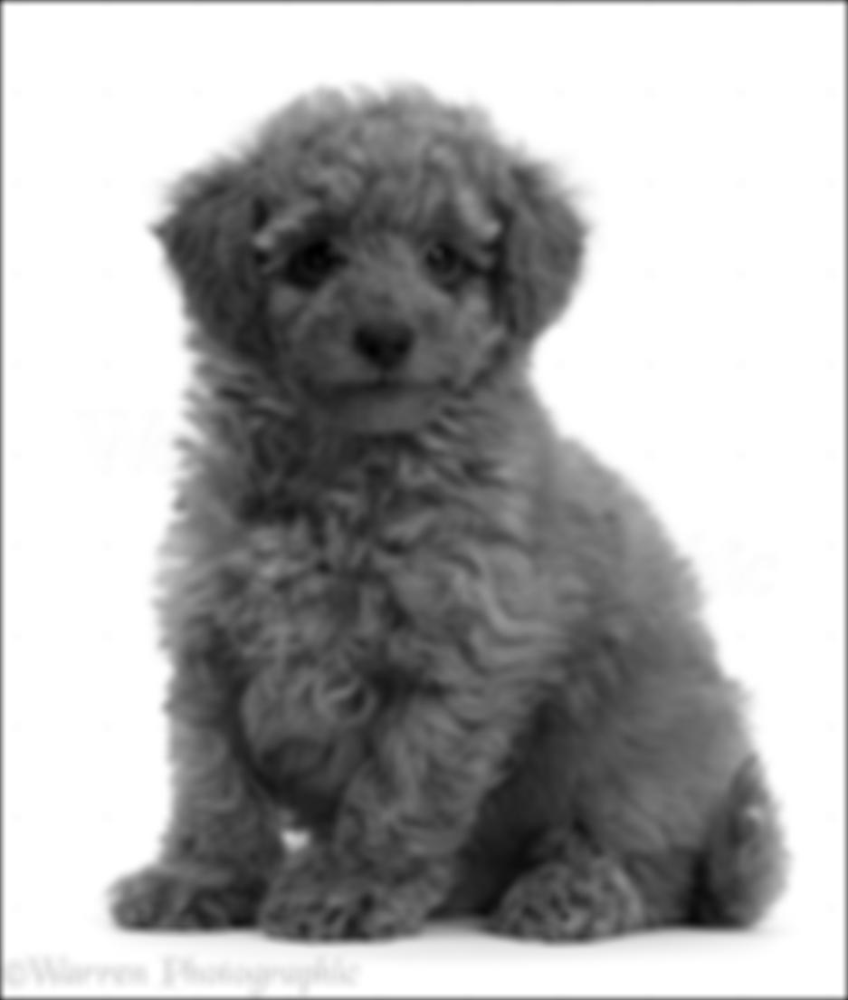</em>

<em>low-pass of image 1</em>
</td>
<td align="left">
<em>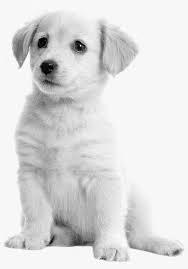</em>

<em>image 2</em>
</td>
<td align="left">
<em></em>

<em>high pass of image 2</em>
</td>
<td align="left">
<em>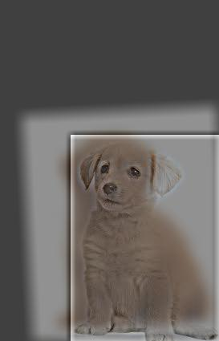</em>

<em>hybrid image</em>
</td>
</tr>
<tr class="even">
<td align="left">
<em>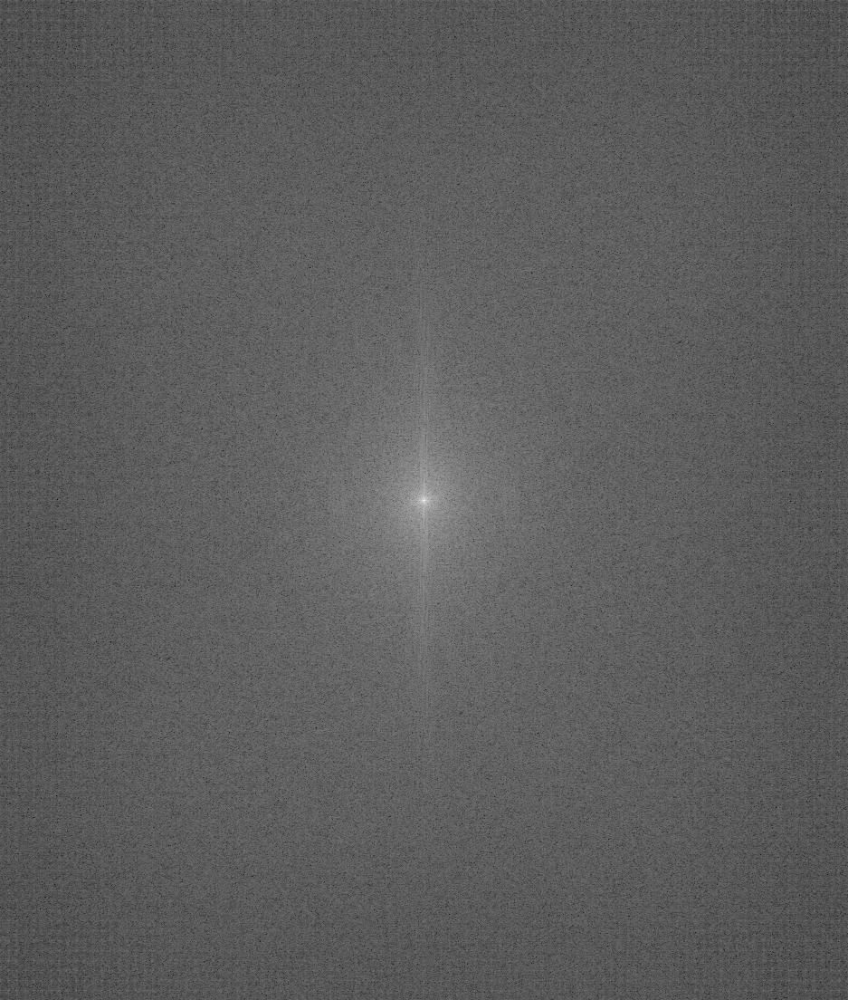</em>

<em>FFT</em>
</td>
<td align="left">
<em>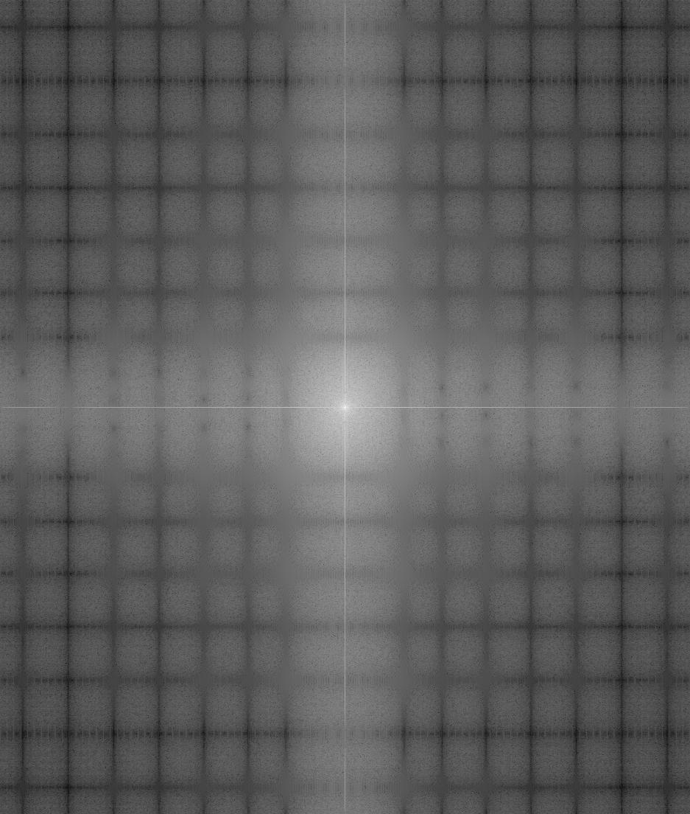</em>

<em>FFT</em>
</td>
<td align="left">
<em>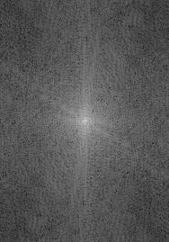</em>

<em>FFT</em>
</td>
<td align="left">
<em></em>

<em>FFT</em>
</td>
<td align="left">
<em>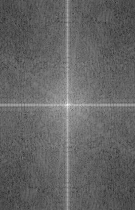</em>

<em> FFT</em>
</td>
</tr>
</tbody>
</table>

#### Part 2.3: Gaussian and Laplacian Stacks
The process of creating Gaussian and Laplacian stacks involves multiple steps to achieve a multiresolution representation of an image. Here's a breakdown of the procedure:

Gaussian Stack:
1. Apply the Gaussian filter at each level of the stack.
2. The Gaussian filter acts as a low-pass filter, smoothing the image and retaining low-frequency information.
3. Each level of the Gaussian stack represents a subsequently more low-pass filtered version of the original image.

Laplacian Stack:
1. For each level of the Gaussian stack (except the last one), take the difference between that level and the following level.
2. This difference creates a high-pass filtered image at each level of the Laplacian stack.
3. The Laplacian stack represents the details or high-frequency components of the image at different resolutions.

I chose to implement 5 levels, meaning that the original image undergoes this process five times, resulting in five levels of both Gaussian and Laplacian stacks. Each level of these stacks provides a different level of detail and contributes to a comprehensive multiresolution representation of the image.

The results of this process are then observed and analyzed to understand how the image's information is distributed across different frequency components at various resolutions.

<table>
<col width="100%" />
<tbody>
<tr class="odd">
<td align="left">
<em></em>

<em>original image</em>
</td>
</tr>
<tr class="even">
<td align="left">
<em>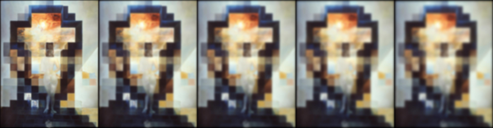</em>

<em>gaussian stack</em>
</td>
</tr>
<tr class="odd">
<td align="left">
<em></em>

<em>laplacian stack</em>
</td>
</tr>
</tbody>
</table>

 

<table>
<col width="100%" />
<tbody>
<tr class="odd">
<td align="left">
<em></em>

<em>original image</em>
</td>
</tr>
<tr class="even">
<td align="left">
<em>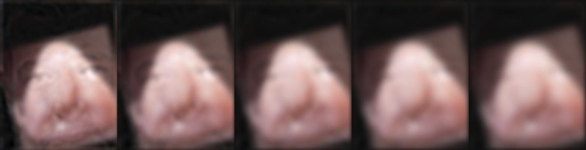</em>

<em>gaussian stack</em>
</td>
</tr>
<tr class="odd">
<td align="left">
<em>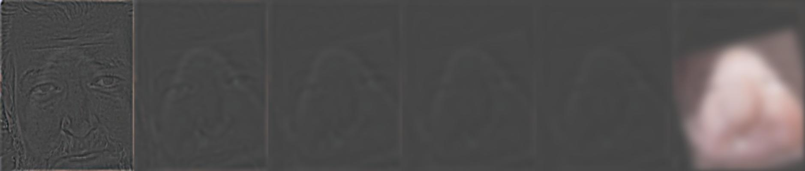</em>

<em>laplacian stack</em>
</td>
</tr>
</tbody>
</table>

 

 

#### Part 2.4: Multiresolution Blending

The goal is two blend two images seamlessly using a multiresolution blending. To do so, I will be utilizing guassian and laplacian stacks. I begin by computing the gaussian and laplacian stacks for two images, again using 5 levels for each stack. I also create a gaussian stack for my mask image. To create the blended image I follow the following equation LSl(i, j) = GRl(i, j)LAl(i, j) + (1 - GRl(i, j))LBl(i, j). Where A and B are the images to be blended together and R is the mask. I then sum LS to create the final blended image. Below are my results

<table>
<col width="25%" />
<col width="25%" />
<col width="25%" />
<col width="25%" />
<tbody>
<tr class="odd">
<td align="left">
<em></em>

<em>image 1</em>
</td>
<td align="left">
<em></em>

<em>image 2</em>
</td>
<td align="left">
<em>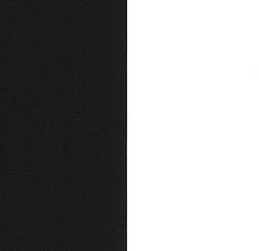</em>

<em>mask</em>
</td>
<td align="left">
<em></em>

<em>blended image</em>
</td>
</tr>
</tbody>
</table>

 

<table>
<col width="25%" />
<col width="25%" />
<col width="25%" />
<col width="25%" />
<tbody>
<tr class="odd">
<td align="left">
<em></em>

<em>image 1</em>
</td>
<td align="left">
<em></em>

<em>image 2</em>
</td>
<td align="left">
<em></em>

<em> mask</em>
</td>
<td align="left">
<em></em>

<em>blended image</em>
</td>
</tr>
</tbody>
</table>

To illustrate the process, I applied the Laplacian stack to the blended image, showcasing the mask that created it.

<table>
<col width="25%" />
<col width="25%" />
<col width="25%" />
<col width="25%" />
<tbody>
<tr class="odd">
<td align="left">
<em>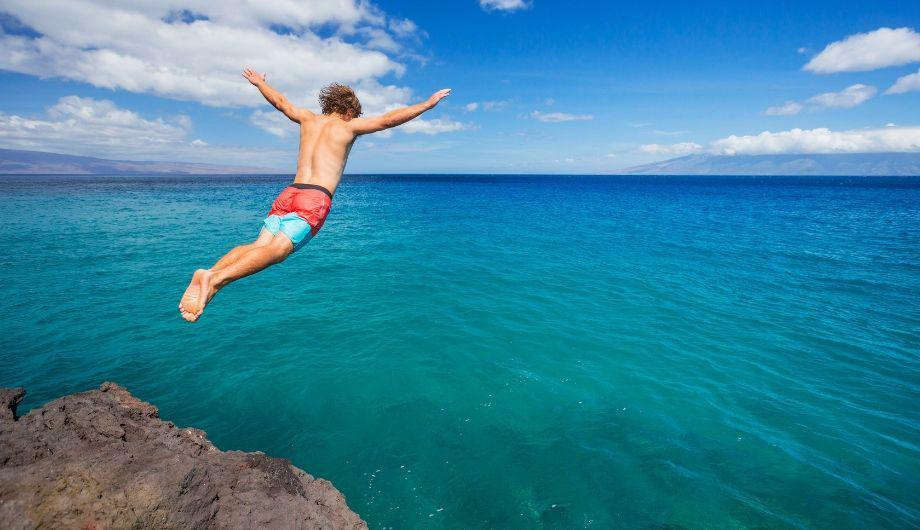</em>

<em>image 1</em>
</td>
<td align="left">
<em>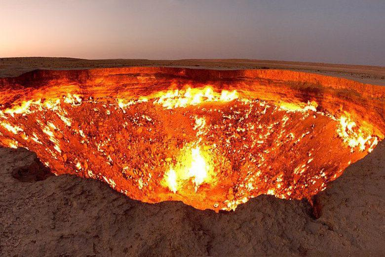</em>

<em>image 2</em>
</td>
<td align="left">
<em>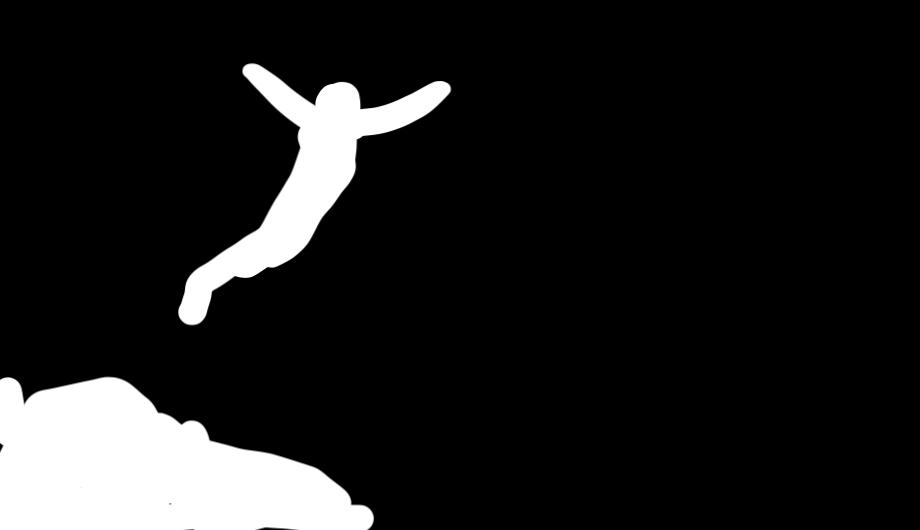</em>

<em> mask</em>
</td>
<td align="left">
<em>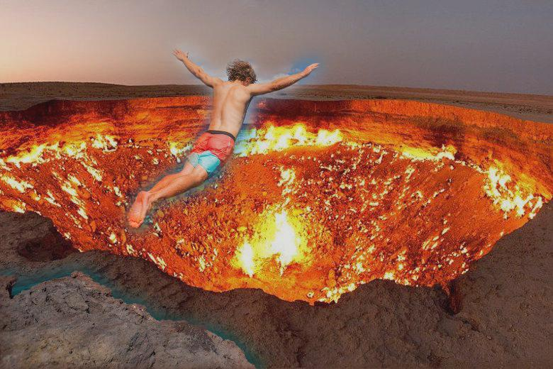</em>

<em>blended image</em>
</td>
</tr>
</tbody>
</table>

<table>
<col width="100%" />
<tbody>
<tr class="odd">
<td align="left">
<em>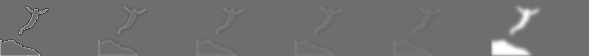</em>

<em>laplacian for mask</em>
</td>
</tr>
<tr class="even">
<td align="left">
<em>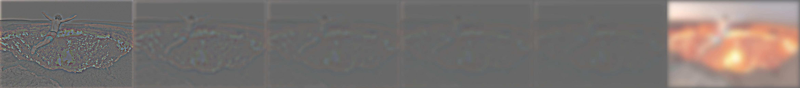</em>

<em>laplacian for blended image</em>
</td>
</tr>
</tbody>
</table>

-
