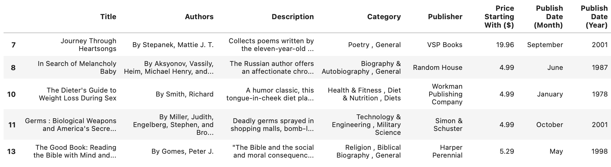
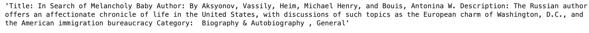

# Book Recommender System Using OpenAI and LangChain

## Overview
This project develops a sophisticated Book Recommender System leveraging OpenAI's language models and the LangChain library. It's designed to suggest books based on user preferences, utilizing advanced natural language processing techniques.


## Data Acquisition
The heart of the system lies in its dataset:

```python
import pandas as pd
import numpy as np

# Loading the dataset
books = pd.read_csv('data/BooksDatasetClean.csv')
```
This dataset, ideally sourced from a comprehensive collection like Kaggle, includes critical information such as titles, authors, descriptions, categories, and publication details.


## Data Preprocessing
The dataset I used for this project, from Kaggle, titled "Books Dataset" by Elvin Rustam, is a comprehensive collection of books, encompassing various details such as titles, authors, descriptions, categories, publishers, prices, and publication dates. The dataset is extensive, covering a broad spectrum of literature, making it a valuable resource for projects involving book recommendations, literary analysis, or data-driven studies in publishing trends (https://www.kaggle.com/datasets/elvinrustam/books-dataset?resource=download)

The data is already cleaned to eliminate symbols and have uniform capitalization. Additonally, I got rid of all books with no descriptions. This left me with roughly 70,000 books to train on.



In order to simply the data for embeddings later on, I combine all Title, Author, Description, and Category, into one column for simplicity and efficiency.




## Embedding and Vectorization
The system uses OpenAI's model for embedding textual data, transforming the textual information of each book into a numerical format:

```python
# Function to get embeddings
def get_embeddings(text_list, model="text-embedding-3-large"):
    processed_texts = [text.replace("\n", " ") for text in text_list]
    response = client.embeddings.create(input=processed_texts, model=model)
    return [item.embedding for item in response.data]
```

The selection of the "text-embedding-3-large" model for generating text embeddings is influenced by several key considerations. Larger models, such as this one, typically offer more advanced language comprehension capabilities. This leads to richer and more nuanced embeddings, capturing the complexities of the text more effectively.


This transformation is crucial for enabling the recommendation algorithm to understand and compare book content effectively.

## LangChain Integration
**LangChain** is a toolkit for building applications with language models, enabling complex tasks like text generation and information retrieval. **LanceDB** complements it by efficiently managing and querying textual data. 

Their use in my project enhances the capabilities of a book recommender system, offering advanced text processing and efficient data handling.
Integrating LangChain and LanceDB, the system creates a retrieval-based question-answering system. I used the following the libaries:

```python
import lancedb
from langchain.embeddings import OpenAIEmbeddings
from langchain.vectorstores import LanceDB # Utilizes LanceDB for storing and retrieving the vector representations (embeddings) of the books.
from langchain.chains import RetrievalQA
```

**langchain.chains.RetrievalQA**: Part of LangChain, this module is used to build a retrieval-based question-answering system, enabling the book recommender to understand user queries and fetch relevant book recommendations based on the embeddings.
This setup enables the system to understand user queries about book preferences and search through the embedded book dataset to find relevant recommendations.

## Recommender System in Action
The recommender system processes user queries, searching the database for books that match the query's intent and context:

```python
query = "I'm looking for a mystery novel set in Victorian England."
docs = docsearch.similarity_search(query, k=3)
```
The output is a list of recommended books with relevant details, tailored to the user's preferences.
## LLM Chain
An LLM (Large Language Model) Chain is a sequence of operations combining the power of large-scale language models with structured querying to deliver accurate and relevant book recommendations. The chain I implemented uses a PromptTemplate to guide the language model with specific instructions for book recommendations, ensuring the output is structured and directly addresses user queries. This method leverages the language model's understanding of text to match books to users' tastes, as exemplified below. My choice of this approach allows for dynamic and context-aware recommendations, making it a powerful tool in the domain of personalized book discovery.

### Technical Summary of LLM Chain Implementation

In this project, the `LLMChain` from the `langchain` library is used to create an interactive book recommendation system. The `PromptTemplate` class structures the input to the language model, crafting a conversation-like exchange where the model plays the role of a recommender:

```python
from langchain.prompts import PromptTemplate
template = """You are a book recommender system that help users to find books that match their preferences. 
Use the following pieces of context to answer the question at the end. 
For each question, suggest three books, with a short description of the plot and the reason why the user might like it.
If you don't know the answer, just say that you don't know, don't try to make up an answer.

Question: {question}
Your response: """
"  # A detailed prompt template for the LLM.
PROMPT = PromptTemplate(
    template=template, input_variables=["question"])
```

The `LLMChain` is then instantiated with the `OpenAI` class from `langchain_openai`. This chain encapsulates the logic to interact with OpenAI's powerful language models:

```python
from langchain.chains import LLMChain
from langchain_openai import OpenAI

#model is gpt-3.5-turbo-instruct
llm = OpenAI(openai_api_key=api_key)
llm_chain = LLMChain(prompt=PROMPT, llm=llm)
```

The choice of `LLMChain` and `OpenAI` integration allows for the leveraging of GPT-3's deep understanding of language nuances, enabling the system to generate personalized book suggestions based on a user's query, as seen here:

```python
question = "i want a book about a girl who falls in love with a vampire..."
response = llm_chain.run(question)
```

This implementation details why `langchain` and `OpenAI` were chosen—maximizing the ability to provide nuanced and contextually relevant book recommendations.

##

**Prompt 1**: "i want a book about a girl who falls in love with a vampire in the northeastern united states and has a werewolf friend

**Results 1**:

| Book Title           | Author         | Description                                                                                                                                                                                                                      |
|----------------------|----------------|----------------------------------------------------------------------------------------------------------------------------------------------------------------------------------------------------------------------------------|
| Twilight             | Stephenie Meyer| This book tells the story of Bella and Edward, a human-vampire pair, in Forks, Washington. Bella's transition into vampirism and motherhood is complicated by her werewolf friend Jacob's affections.                            |
| The Immortal Rules   | Julie Kagawa   | Allison Sekemoto becomes a vampire in a dystopian future and must deal with the complexities of vampire society, her love for a human, and the truths of her existence.                                                           |
| Evernight            | Claudia Gray   | Bianca's romance with Lucas, a vampire, unfolds amidst secrets at her boarding school in the northeastern U.S., challenging her understanding of her life and surroundings.   
|


**Prompt 2**: "i like books about utopian usurps from young adults who try to change the world for the better and fight"

**Results 2**:

| Book Title       | Author          | Description                                                                                                                                                                                                                                              |
|------------------|-----------------|----------------------------------------------------------------------------------------------------------------------------------------------------------------------------------------------------------------------------------------------------------|
| The Hunger Games | Suzanne Collins | A young girl named Katniss Everdeen volunteers to participate in a brutal, televised event in a dystopian society. She becomes a beacon of hope and symbolizes the rebellion against the totalitarian government while fighting for survival and change. |
| Divergent        | Veronica Roth   | Tris Prior uncovers her Divergence in a society split into factions based on virtues. Her journey reveals the cracks within the faction system, leading her to challenge the societal norms and fight against a concealed tyranny.                        |
| The Giver        | Lois Lowry      | Jonas, living in a community devoid of pain and suffering, is appointed as Receiver of Memories and uncovers the harsh realities of his society's past. Gaining knowledge forbidden to others, he becomes determined to bring change.                      |


**Prompt 3**: "I recently read a court of thorns and roses, can you recommend similar books?"

**Results 3**:

| Book Title         | Author           | Description                                                                                                                                                                                           |
|--------------------|------------------|-------------------------------------------------------------------------------------------------------------------------------------------------------------------------------------------------------|
| Shadow and Bone    | Leigh Bardugo    | A fantasy novel featuring a strong female lead and a complex magical world. It includes a romance subplot and themes of power and betrayal, reminiscent of "A Court of Thorns and Roses."              |
| Cruel Beauty       | Rosamund Hodge   | A dark and atmospheric retelling of "Beauty and the Beast," this book shares thematic similarities with "A Court of Thorns and Roses," with a main character navigating a treacherous world.           |
| The Wrath and the Dawn | Renee Ahdieh    | This book parallels "A Court of Thorns and Roses" in its blend of romance, magic, and danger. It's a retelling of "One Thousand and One Nights" featuring a strong, clever female protagonist.         |


## Conclusion
This Book Recommender System represents a significant advancement in personalized book recommendations. By harnessing OpenAI's embeddings and LangChain's flexibility, it offers a sophisticated, user-friendly tool for book enthusiasts seeking tailored reading suggestions.
