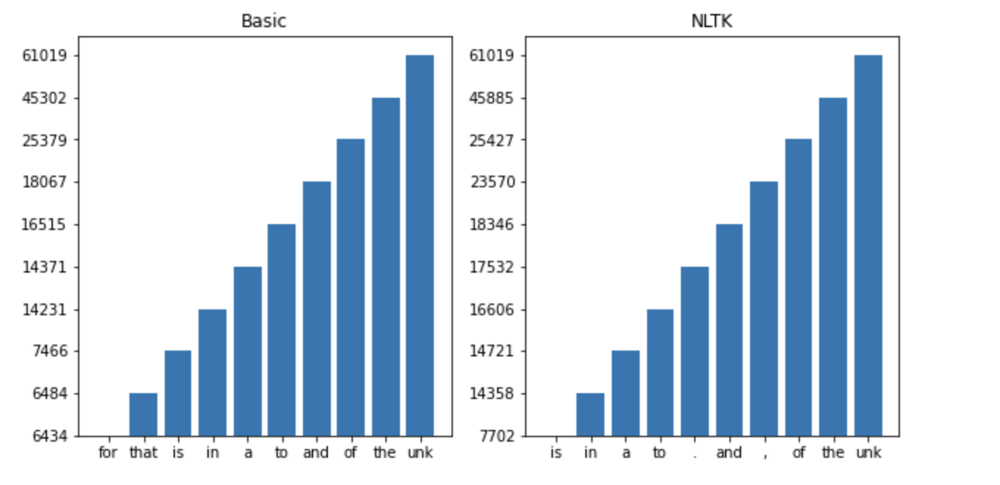

# Smoothing and Language Models

In this project I experiment with language models and implement smoothing. I also look at effecrs of using unigram and bigram LM and the size of training data.

## Tokinzers

I begin by writing two tokenizers, a basic one, and a nltk tokenizer.

**Basic Tokenization** The basic tokenization method is a straightforward approach to splitting text into tokens. It operates by dividing the input text using whitespace, such as spaces or tabs. This method is a quick and efficient way to tokenize text and is suitable for many common text processing tasks. However, it doesn't handle more intricate tokenization scenarios, such as managing punctuation or contractions. Users seeking a simple and fast tokenization method can opt for this basic approach.

**NLTK Tokenization** The NLTK tokenization method, employs NLTK's word_tokenize() function for tokenization. NLTK provides advanced tokenization capabilities, including the ability to handle punctuation, contractions, and language-specific tokenization rules. This method is ideal for tasks where fine-grained and linguistically accurate tokenization is essential. However, it may be somewhat slower and resource-intensive compared to the basic tokenization, making it a suitable choice for more complex tokenization requirements.

## Language Model and Smoothing
I will first compute the bigram counts and estimate bigram probabilities. We will then implement add-alpha smoothing to modify the probabilities.

### Computing Bigram Probabalities

Our models hols are the variable self.bi_counts, which is a data structure that holds the bigram counts. Specifically, it is a two-dimensional array where self.bi_counts[i][j] represents the count of the bigram where the first word has an index i in the vocabulary, and the second word has an index j in the vocabulary. These counts represent how often each bigram occurs in the training corpus.

The classic computation for bigram probabilities is as follows:
1. For each row in self.bi_prob (initially self.bi_counts), calculate the sum of its values.
2. If the sum is greater than 0, normalize the row by dividing all its values by the sum.

In essence, this method calculates and normalizes bigram probabilities stored in self.bi_prob.


To incorporate alpha smoothing, I follow the Laplace (add-alpha) smoothing bigram method. Laplace smoothing is used to assign small, non-zero probabilities to unseen events in statistical models, preventing the problem of zero probabilities and enhancing the model's ability to make reasonable predictions for previously unobserved data. Its primary purpose is to improve the generalization and robustness of language and probability models by ensuring that all events, even rare or unseen ones, receive some level of consideration in the model's probability estimates.


It follows the equation from the textbook "Speech and Language Processing" by Daniel Jurafsky and James H. Martin:


To add this to the code, I do following when calcuating probabilties:
1. Iterate through each row of self.bi_prob (initially self.bi_counts) (representing bigrams) using an index i.
2. Calculate the total count of the current bigram using cnt = np.sum(self.bi_prob[i]).
3. Add a smoothing parameter alpha to each count in the row by performing top = self.bi_prob[i] + alpha.
4. Compute smoothed probabilities for each bigram in the row by dividing the smoothed counts (top) by the total count (cnt) and adding the size of the vocabulary (V) to the denominator. This step incorporates Laplace (add-alpha) smoothing into the bigram probabilities.
5. Update the self.bi_prob[i] with the computed smoothed probabilities for the current bigram.


This code block calculates bigram probabilities with Laplace smoothing (add-alpha smoothing) by adding a small value alpha to each count and adjusting the probabilities to ensure they sum up to 1 while considering the vocabulary size V. This smoothing helps handle cases where some bigrams have zero counts in the training data and avoids zero probability issues.

Here is an exmample of add-one smoothing from the same textbook above.


### Training 
The training begins by initializeing a bigram model (self.n=2). It creates a matrix self.bi_counts to store the counts of all possible bigrams between words in the vocabulary. The code then converts the training corpus into token indices and proceeds to gather the counts of observed bigrams within the corpus. If no smoothing is specified (self.smoothing is None), it computes the bigram probabilities directly using the computeBigramProb method. Alternatively, if Laplace smoothing with add-alpha smoothing is selected (self.smoothing is 'addAlpha'), it calculates smoothed probabilities using the computeBigramProbAddAlpha method, with the smoothing parameter specified by self.smoothing_param. In case of any other smoothing type, it raises a ValueError. This code segment is designed to train a bigram language model and pre-compute bigram probabilities based on the chosen smoothing technique for later language modeling tasks.


## Experiments

### Word Frequency
This experiment involves visualizing and comparing the frequency of the top ten words in a corpus using two different tokenization methods: a basic tokenizer and NLTK tokenizer. The hope is that this experiment will provide insights into the impact of tokenization coices on word frequencey patterns.



The frequencies of the top words in both tokenizers are fairly similar for words like 'the', 'of', and 'to', which suggests that the overall content of the text corpus is consistent between the two. However, the specific frequencies and the order of the words differ slightly due to the different tokenization methods.


### Perplexity 

In order to test the language model, I used perplexity as my main metric. Perplexity is a measurement in Natural Language Processing (NLP) that quantifies how well a probabilistic model predicts a sample. It is commonly used to evaluate language models, which are models that can predict the probability distribution of words in a language.

```python
def test(self, corpus):
    logprob = 0.0

    # Convert to token indices.
    corpus = [self.token_to_idx[w] for w in corpus]

    for i, idx in enumerate(tqdm(corpus[:1-self.n], desc="Evaluating")):
        logprob += np.log(self.bi_prob[idx, corpus[i+1]])

    # Calculate the average negative log likelihood
    logprob /= len(corpus[:1-self.n])

    # Compute perplexity
    ppl = np.exp(-logprob)

    return ppl

```

When testing with either tokenizer and no smoothing, I recieve a perplexity of Inf. This is due to do to the fact that there is an issue where the model assigns a probability of zero to some word sequences in the validation set. Since the language model does not implement a smoothing technique, it's likely to assign a zero probability to unseen word sequences or n-grams.

To test smoothing, I compared different alphas values (alpha =  [0.001, 0.01, 0.05, 0.1, 0.5, 1,2, 10]) to see how they affect perplexity. Generally speaking, the classic form of laplace smoothing is "add alpha = 1". In this case, we assume we have seen each word one additional time than we actually have. This method is simple but often introduces too much bias, especially when the vocabulary size is large compared to the actual counts of the words. When alpha is less than 1 ($0<\alpha<1$), we give less additional probability to unseen words, which can be useful when you have a large vocabulary but expect that unseen words should not be given too much probability mass. When alpha is larger than 1, there is probability mass to unseen words. This can be useful when you have a smaller vocabulary or when you want to minimize the impact of high-frequency words and give more chances to rare words. A higher $\alpha$ generally increases perplexity, because it suggests that the model is less certain about its predictions.

In the following experiment, it is worth nothing that the size of the vocabulary model is 21788. I also trained on 90% of the data and tested on the remaining 10. 


These are very interesting results. While the usual alpha values is between 0.1 and 2, I found that a value of 0.01 performed the best. 

Given the vocabulary size of 20,000, an alpha value of 1 or higher introduces a significant amount of probability mass to unseen words, which can dilute the model's learned probabilities. The effect is a model that is too generalized and not very informative, which is reflected in the rising perplexity. The optimal alpha value likely lies somewhere between 0.001 and 1, where the perplexity is lower, indicating a better fit to the data without overfitting or underfitting.
